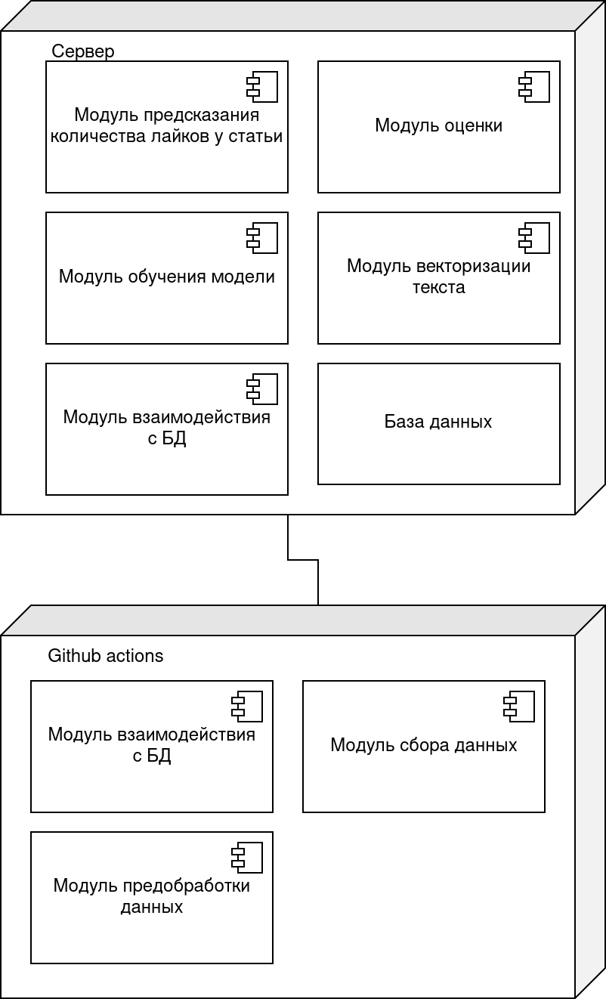

# Описание проекта
## Название проекта: habr-posts-likes-prediction
### Цель: Автоматиация процесса оценки текстового содержимого статьи на Habr

Задачи:
1. Разработка архитектуры системы.
2. Подготовка исходных данных.
3. Анализ существующих моделей.
4. Обучение и оценка моделей на исходном датасете.
5. Выбор наиболее оптимальной модели.
6. Развертывание наилучшей модели.  

Датасет: [Habr dataset](https://huggingface.co/datasets/IlyaGusev/habr)  
Проект: [habr-posts-likes-prediction](https://github.com/P-a-V-e-LL/habr-posts-likes-prediction)

### Целесообразность использования датасета для решения поставленной задачи:
Датасет содержит текст статьи, заголовок, статистику по лайкам/комментариям.
Чтобы подтвердить целесообразность использования выбранного датасета, был проведен эксперимент по предсказанию количества лайков с помощью текстового контента. В качестве данных были выбраны первые 100 слов в preview статьей и TF-IDF Vectorizer. Полученные вектора были использованы для задачи регрессии с помощью XGBoost Regressor. В результате была получена средняя абсолютная ошибка (MAE) равная 22.7 (математическое ожидание 33, стандартное отклонение 40.7). Тем самым было подтверждено, что поставленную задачу можно решить, используя выбранный датасет.

### Диаграмма компонентов

### Диаграмма активностей

### Диаграмма развертывания

